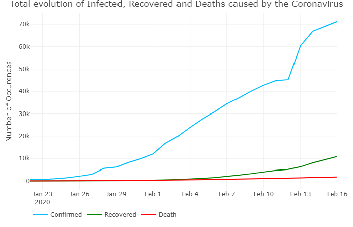
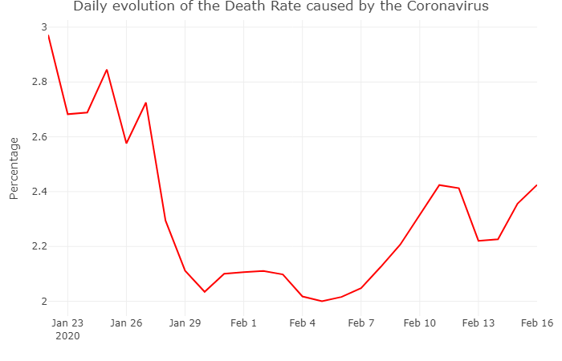
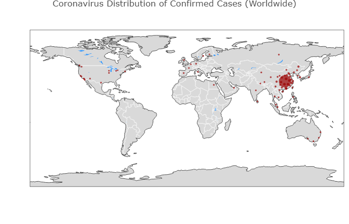
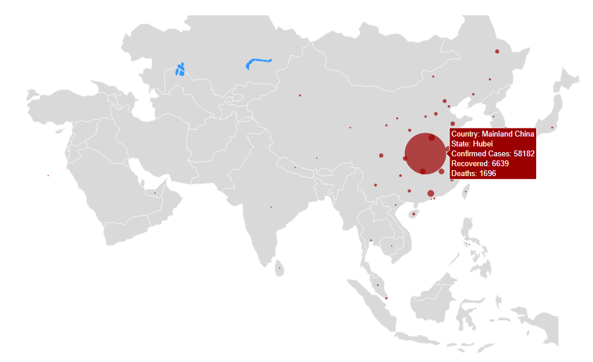

# Coronavirus Data Analysis

<!-- badges: start --->

[](https://opensource.org/licenses/MIT)
<!-- badges: end -->


Coronavirus (COVID-19 (2019-nCoV)) is a new strain of coronavirus that has not been previously identified in humans.  The new, or “novel” coronavirus, now called 2019-nCoV, had not previously detected before the outbreak was reported in Wuhan, China in December 2019. [World Health Organization](https://www.who.int/news-room/q-a-detail/q-a-coronaviruses)

This repository aims to present a set of analysis to the data available relationed with the Coronavirus.

The data used in this study is from the Johns Hopkins University Center for Systems Science and Engineering. More info, visit [here](https://github.com/CSSEGISandData/COVID-19).

This language used in this study is R and the study is structured by the Project Template package available in CRAN. More info, visit [Project Template website](http://projecttemplate.net/index.html).

## Usage

Install the CRAN version:

``` r
install.packages("ProjectTemplate")
```

Once you have download the project you need to set your working directory to the project folder and after that, load the project:

``` r
setwd('/project_folder_path')
library("ProjectTemplate")
load.project()
```

The load project function will load the packages needed to this study download the data from the repository and treat the data based on the objectives of this study.

``` r
## more information about the download of the data view the file load.r
file.edit("data/load.r")
## more information about the data treatment view the file data_treatment.r
file.edit("munge/data_treatment.r")
```

This datasets loaded contains the following fields:

``` r
> head(confirmed)
  State        Country      Lat     Long       Date Confirmed Confirmed_day
1 Anhui Mainland China 31.82571 117.2264 2020-01-22         1             1
2 Anhui Mainland China 31.82571 117.2264 2020-01-23         9             8
3 Anhui Mainland China 31.82571 117.2264 2020-01-24        15             6
4 Anhui Mainland China 31.82571 117.2264 2020-01-25        39            24
5 Anhui Mainland China 31.82571 117.2264 2020-01-26        60            21
6 Anhui Mainland China 31.82571 117.2264 2020-01-27        70            10
> head(recovered)
  State        Country      Lat     Long       Date Recovered Recovered_day
1 Anhui Mainland China 31.82571 117.2264 2020-01-22         0             0
2 Anhui Mainland China 31.82571 117.2264 2020-01-23         0             0
3 Anhui Mainland China 31.82571 117.2264 2020-01-24         0             0
4 Anhui Mainland China 31.82571 117.2264 2020-01-25         0             0
5 Anhui Mainland China 31.82571 117.2264 2020-01-26         0             0
6 Anhui Mainland China 31.82571 117.2264 2020-01-27         0             0
> head(death)
  State        Country      Lat     Long       Date Death Death_day
1 Anhui Mainland China 31.82571 117.2264 2020-01-22     0         0
2 Anhui Mainland China 31.82571 117.2264 2020-01-23     0         0
3 Anhui Mainland China 31.82571 117.2264 2020-01-24     0         0
4 Anhui Mainland China 31.82571 117.2264 2020-01-25     0         0
5 Anhui Mainland China 31.82571 117.2264 2020-01-26     0         0
6 Anhui Mainland China 31.82571 117.2264 2020-01-27     0         0
```

In this sudy, my personal goal was to create the plots using the [Plotly](https://plot.ly/) Package, more specific creating map plots with this package.`

The code developed for the plots is in the file plots.r
``` r
file.edit("src/plots.r")
```

### Evolution of the Coronavirus

</a>

This plot presents the evolution of Coronavirus case in the world as well as the recovered and the death cases.

</a>

This plot shows the daily variation of new cases, recoverys and deaths caused by the Coronavirus.

</a>

This plot contains the variation of the Coronavirus Mortality Rate.

### Distribution of cases in the world

The next set of plots shows the number of Confirmed cases with the Coronavirus, where the last plot details the number of confirmed cases presents in Asia (where this new virus was detected first).

</a>

</a>

<br>